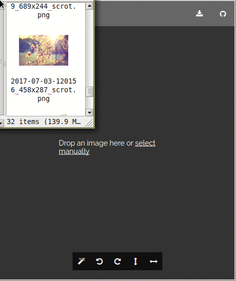

# image-pixel-manipulation  

Allows to apply different effects/filters on images.

## Description
You can upload an image and apply different effects to it. Included effects: saturation, color invert, greyscale, noise, etc. Effects are configurable, for example user can change noise level or select specific channels for saturation.
User-initiated changes are undoable and redoable. This functionality is implemented using [Command pattern](https://en.wikipedia.org/wiki/Command_pattern). [CommandManager](src/command/CommandManager.js) keeps a stack of the most recently executed commands.

ReactJS used as a view layer, because it proposes a simple way to create composable components. Tests are written using Jest and Enzyme.

## Demo
Checkout [demo](https://kubk.github.io/image-pixel-manipulation/build) in your browser.

## Installation
1. `git clone https://github.com/kubk/image-pixel-manipulation`
2. `yarn install`
3. `yarn start`

## Example

## Testing
Run tests using `yarn test`

## Browser support
- Firefox Android v54+
- Chrome Android v59+
- Chrome Desktop v51+
- Firefox Desktop v48+

I plan to add support for older browsers.
